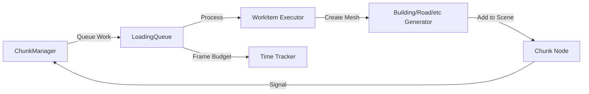

# Frame-Budget Loading Queue - Architecture Design

## 🎯 Objective
Design a work queue system that spreads chunk loading across multiple frames to maintain smooth 60fps.

**Core Principle:** Never spend more than 5ms per frame on loading work.

---

## 🏗️ Architecture Overview



---

## 📦 LoadingQueue Class

**File:** `scripts/city/loading_queue.gd`

### Class Definition

```gdscript
extends RefCounted
class_name LoadingQueue

## Frame-budget work queue for chunk loading
##
## Manages a queue of work items (building, road, park, water creation)
## and processes them gradually with a frame time budget to prevent stuttering.

# ========================================================================
# SIGNALS
# ========================================================================

signal work_completed(type: String, chunk_key: Vector2i, node: Node3D)
signal chunk_fully_loaded(chunk_key: Vector2i)
signal queue_empty()
signal queue_progress(items_remaining: int, items_total: int)

# ========================================================================
# CONFIGURATION
# ========================================================================

@export var frame_budget_ms: float = 5.0  ## Max time to spend on loading per frame
@export var enable_logging: bool = false   ## Enable detailed logging

# ========================================================================
# STATE
# ========================================================================

var work_queue: Array[Dictionary] = []  # Queue of work items
var work_in_progress: Dictionary = {}   # Work being processed this frame
var completed_work: Array = []          # Work completed (for stats)

# Chunk tracking
var chunks_loading: Dictionary = {}     # chunk_key → {total: int, completed: int}

# Statistics
var total_items_queued: int = 0
var total_items_completed: int = 0
var total_time_spent_ms: float = 0.0

# ========================================================================
# PUBLIC API
# ========================================================================

func queue_work(work_item: Dictionary) -> void:
    """Add a work item to the queue"""

func process(delta: float) -> void:
    """Process work items within frame budget (call every frame)"""

func clear_queue() -> void:
    """Clear all pending work"""

func get_stats() -> Dictionary:
    """Get queue statistics for display"""

func is_chunk_loading(chunk_key: Vector2i) -> bool:
    """Check if a chunk is currently being loaded"""

func cancel_chunk(chunk_key: Vector2i) -> void:
    """Cancel all work for a specific chunk"""
```

---

## 🧩 Work Item Structure

```gdscript
{
    # Identification
    "type": String,          # "building", "road", "park", "water", "distant_water"
    "chunk_key": Vector2i,   # Which chunk this belongs to
    "id": String,            # Unique ID (for tracking)

    # Data
    "data": Dictionary,      # building_data, road_data, etc.
    "chunk_node": Node3D,    # Parent node to add created item to

    # Priority (for sorting)
    "priority": float,       # Lower = higher priority (distance from camera)

    # Timing
    "estimated_cost_ms": float,  # Estimated time to execute (for scheduling)
    "queued_time": float,        # When it was queued (for metrics)

    # References (for execution)
    "factory": Object,       # FeatureFactory reference
    "tracking_array": Array  # buildings/roads array (for tracking)
}
```

---

## ⚙️ Processing Algorithm

### process() Function

```gdscript
func process(delta: float) -> void:
    if work_queue.is_empty():
        if not chunks_loading.is_empty():
            # All queued work done, but some chunks may still be "loading"
            _finalize_loaded_chunks()
        return

    var frame_start_time = Time.get_ticks_usec()
    var budget_microsec = frame_budget_ms * 1000.0
    var time_spent_microsec = 0.0

    # Sort queue by priority (closest first)
    _sort_queue()

    # Process work items until budget exhausted
    while not work_queue.is_empty() and time_spent_microsec < budget_microsec:
        var work_item = work_queue.pop_front()

        # Execute work item
        var item_start_time = Time.get_ticks_usec()
        _execute_work_item(work_item)
        var item_elapsed = Time.get_ticks_usec() - item_start_time

        # Track time
        time_spent_microsec += item_elapsed
        total_time_spent_ms += item_elapsed / 1000.0
        total_items_completed += 1

        # Update chunk loading progress
        _update_chunk_progress(work_item.chunk_key)

        # Emit progress signal
        queue_progress.emit(work_queue.size(), total_items_queued)

        # Log if enabled
        if enable_logging:
            print("[LoadingQueue] Completed ", work_item.type, " for chunk ",
                  work_item.chunk_key, " in ", item_elapsed / 1000.0, "ms")

    # Log frame summary
    if enable_logging and time_spent_microsec > 0:
        print("[LoadingQueue] Frame processed: ", time_spent_microsec / 1000.0,
              "ms / ", frame_budget_ms, "ms budget")
```

---

## 🔧 Work Item Execution

### _execute_work_item() Function

```gdscript
func _execute_work_item(work_item: Dictionary) -> void:
    match work_item.type:
        "building":
            _execute_building(work_item)
        "road":
            _execute_road(work_item)
        "park":
            _execute_park(work_item)
        "water":
            _execute_water(work_item)
        "distant_water":
            _execute_distant_water(work_item)
        _:
            push_warning("Unknown work item type: " + work_item.type)

func _execute_building(work_item: Dictionary) -> void:
    var building_data = work_item.data
    var chunk_node = work_item.chunk_node
    var tracking_array = work_item.tracking_array

    # Call existing generator
    var building_node = BuildingGeneratorMesh.generate_building(
        building_data, chunk_node, tracking_array
    )

    # Emit completion signal
    work_completed.emit("building", work_item.chunk_key, building_node)

func _execute_road(work_item: Dictionary) -> void:
    # Similar pattern for roads
    ...

# etc. for other types
```

---

## 📊 Priority System

### Priority Calculation

```gdscript
func _calculate_priority(item_position: Vector2, camera_position: Vector2) -> float:
    # Lower priority = execute first
    # Priority = distance from camera
    return camera_position.distance_to(item_position)

func _sort_queue() -> void:
    work_queue.sort_custom(func(a, b):
        return a.priority < b.priority
    )
```

**Effect:** Items closest to camera load first.

---

## 🎯 Chunk State Tracking

### chunks_loading Dictionary

```gdscript
chunks_loading[Vector2i(0, 0)] = {
    "total": 15,        # Total work items for this chunk
    "completed": 8,     # Items completed so far
    "types": {          # Breakdown by type
        "building": 10,
        "road": 3,
        "park": 1,
        "water": 1
    }
}
```

### Progress Tracking

```gdscript
func _update_chunk_progress(chunk_key: Vector2i) -> void:
    if not chunks_loading.has(chunk_key):
        return

    var chunk_info = chunks_loading[chunk_key]
    chunk_info.completed += 1

    # Check if chunk fully loaded
    if chunk_info.completed >= chunk_info.total:
        chunk_fully_loaded.emit(chunk_key)
        chunks_loading.erase(chunk_key)

        if enable_logging:
            print("[LoadingQueue] Chunk ", chunk_key, " fully loaded!")
```

---

## 🔗 Integration with ChunkManager

### Modified ChunkManager

```gdscript
# Add LoadingQueue
var loading_queue: LoadingQueue

func _init(p_feature_factory, p_scene_root: Node3D):
    feature_factory = p_feature_factory
    scene_root = p_scene_root

    # Create loading queue
    loading_queue = LoadingQueue.new()
    loading_queue.frame_budget_ms = 5.0
    loading_queue.chunk_fully_loaded.connect(_on_chunk_fully_loaded)
    loading_queue.work_completed.connect(_on_work_completed)

# Modified load_chunk - queue work instead of immediate
func load_chunk(chunk_key: Vector2i):
    if chunk_states.get(chunk_key) == "loading" or chunk_states.get(chunk_key) == "loaded":
        return

    # Create chunk container (immediate)
    var chunk_node = Node3D.new()
    chunk_node.name = "Chunk_%d_%d" % [chunk_key.x, chunk_key.y]
    scene_root.add_child(chunk_node)

    # Mark as loading
    chunk_states[chunk_key] = "loading"

    # Get data
    var buildings_in_chunk = building_data_by_chunk.get(chunk_key, [])
    var roads_in_chunk = road_data_by_chunk.get(chunk_key, [])
    var parks_in_chunk = park_data_by_chunk.get(chunk_key, [])
    var water_in_chunk = water_data_by_chunk.get(chunk_key, [])

    # Queue work items
    var camera_pos = _get_current_camera_position()  # Need to store this
    var total_items = 0

    # Queue buildings
    for building_data in buildings_in_chunk:
        loading_queue.queue_work({
            "type": "building",
            "chunk_key": chunk_key,
            "id": "building_" + str(building_data.get("id", "")),
            "data": building_data,
            "chunk_node": chunk_node,
            "priority": _calculate_priority(building_data.get("center"), camera_pos),
            "estimated_cost_ms": 10.0,  # Estimate
            "queued_time": Time.get_ticks_msec(),
            "factory": feature_factory,
            "tracking_array": buildings
        })
        total_items += 1

    # Queue roads, parks, water similarly...
    # ...

    # Track chunk loading
    loading_queue.chunks_loading[chunk_key] = {
        "total": total_items,
        "completed": 0
    }

# Update loop - process queue every frame
func update(delta: float, camera_pos: Vector3):
    # Process loading queue (every frame)
    loading_queue.process(delta)

    # Check for streaming updates (less frequent)
    update_timer += delta
    if update_timer >= chunk_update_interval:
        _update_streaming(Vector2(camera_pos.x, -camera_pos.z))
        _queue_distant_water(Vector2(camera_pos.x, -camera_pos.z))
        update_timer = 0.0

# Signal handlers
func _on_chunk_fully_loaded(chunk_key: Vector2i):
    chunk_states[chunk_key] = "loaded"
    print("✅ Chunk fully loaded: ", chunk_key)

func _on_work_completed(type: String, chunk_key: Vector2i, node: Node3D):
    # Optional: track individual work items
    pass
```

---

## 📈 Performance Estimates

### Frame Budget Breakdown

**60 FPS = 16.67ms per frame**

Budget allocation:
- Rendering: ~8-10ms
- Physics: ~1-2ms
- Scripts/logic: ~2-3ms
- **Loading work: ~5ms** ← Our budget
- Margin: ~1-2ms

### Work Item Costs (Estimated)

| Type | Simple | Medium | Complex |
|------|--------|--------|---------|
| Building | 5ms | 15ms | 40ms |
| Road | 2ms | 5ms | 10ms |
| Park | 3ms | 8ms | 15ms |
| Water | 5ms | 20ms | 150ms (Lake Union) |

### Loading Time Examples

**Example 1: Simple chunk (10 buildings, 2 roads)**
- Total cost: ~60ms
- With 5ms budget: 12 frames = 200ms real-time
- **Result:** Smooth, no stutter

**Example 2: Dense chunk (50 buildings, 10 roads)**
- Total cost: ~300ms
- With 5ms budget: 60 frames = 1 second real-time
- **Result:** Smooth, gradual loading

**Example 3: Lake Union**
- Total cost: ~150ms
- With 5ms budget: 30 frames = 500ms real-time
- **Result:** Smooth, no single-frame spike

---

## 🎯 Success Metrics

### Target Performance
- Frame time: <16.67ms (60fps)
- Loading budget: ≤5ms per frame
- Max spike: <10ms (occasional OK)
- Perceived smoothness: No visible stuttering

### Queue Metrics
- Average queue depth: <20 items (typical)
- Max queue depth: <100 items (worst case)
- Processing rate: 1-3 items per frame
- Chunk load time: 200-1000ms spread over frames

---

## 🔮 Future Enhancements

### Adaptive Budget
```gdscript
func _adjust_budget_based_on_fps(current_fps: float):
    if current_fps < 55:
        frame_budget_ms = max(2.0, frame_budget_ms - 0.5)
    elif current_fps > 65:
        frame_budget_ms = min(8.0, frame_budget_ms + 0.5)
```

### Work Item Cost Learning
```gdscript
var work_cost_history: Dictionary = {
    "building": [],
    "road": [],
    # ...
}

func _learn_work_cost(type: String, actual_cost_ms: float):
    work_cost_history[type].append(actual_cost_ms)
    if work_cost_history[type].size() > 100:
        work_cost_history[type].pop_front()

    # Use median for better estimates
    return _calculate_median(work_cost_history[type])
```

### Predictive Scheduling
```gdscript
func _schedule_work_optimally():
    # Look ahead at estimated costs
    # Pack small items together
    # Avoid multiple large items in sequence
    # Balance between chunks
```

---

Last Updated: 2025-01-23
Status: Design complete, ready for implementation
