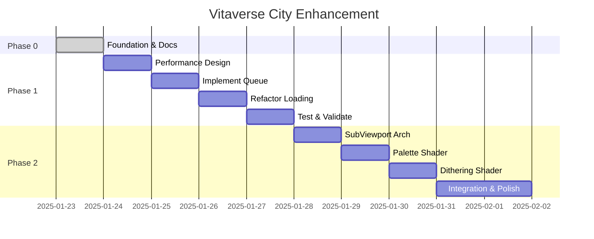

# Project Plan: Vitaverse City Enhancement

## 🎯 Project Goals

Transform Vitaverse City into a smooth, performant retro 3D world with an authentic PSX/Saturn aesthetic.

### Primary Objectives
1. **Eliminate stuttering** during chunk loading/streaming
2. **Implement hybrid retro aesthetic** (native low-res + palette + dithering)
3. **Maintain 60fps** performance
4. **Configurable settings** for user experimentation

---

## 📋 Three-Phase Approach

### Phase 0: Foundation & Documentation
**Purpose:** Set up multi-session infrastructure
**Duration:** 1 session
**Status:** 🚧 IN PROGRESS

Create planning documentation system to support multi-session development:
- Bootstrap procedure for new Claude sessions
- Progress tracking system
- Technical decision log
- Detailed implementation plans
- Session logs

**Deliverables:**
- `.planning_docs/` structure
- README.md (bootstrap guide)
- PROGRESS.md (status tracker)
- DECISIONS.md (technical rationale)
- Detailed phase plans
- Profiling instrumentation

---

### Phase 1: Performance Fix
**Purpose:** Eliminate stuttering via frame-budget loading
**Duration:** 2-3 sessions (estimated)
**Status:** ⏸️ NOT STARTED
**Dependencies:** Phase 0 complete

**Problem:**
Current system loads chunks synchronously, causing frame time spikes:
- Every 1 second: chunk update triggers
- Loads up to 2 chunks immediately (all buildings/roads/parks)
- `_load_distant_water()` has unbounded mesh generation
- Lake Union (50,000+ m²) creates huge mesh synchronously
- Result: Periodic 100-200ms frame spikes

**Solution:**
Frame-budget queue system:
- Create LoadingQueue class (5ms/frame budget)
- Convert immediate loading to queued work items
- Spread mesh generation across multiple frames
- Fix distant water to respect budget
- Smooth loading, no perceptible stutters

**See:** `plan/phase-1-performance.md` for detailed plan

---

### Phase 2: Hybrid Retro Aesthetic
**Purpose:** Implement native low-res + palette + dithering
**Duration:** 3-4 sessions (estimated)
**Status:** ⏸️ NOT STARTED
**Dependencies:** Phase 1 complete (or started)

**Current State:**
- Basic post-processing pixelation (pixel_size = 3)
- No palette quantization
- No dithering
- Generic look

**Target State:**
- Native low-res rendering via SubViewport (480×360)
- 64-color palette quantization
- Bayer matrix dithering
- Authentic PSX/Saturn aesthetic
- Runtime-configurable settings

**Architecture Change:**
Major refactor of city_renderer.gd to move 3D scene into SubViewport, apply palette/dithering shaders during upscaling.

**See:** `plan/phase-2-visuals.md` for detailed plan

---

## 🎯 Success Metrics

### Performance (Phase 1)
- [ ] No stuttering during rapid camera movement
- [ ] Consistent 60fps
- [ ] Frame time spikes <5ms
- [ ] Smooth chunk loading/unloading

### Visual (Phase 2)
- [ ] Authentic retro 3D aesthetic
- [ ] Cohesive color palette
- [ ] Smooth dithered gradients
- [ ] Buildings/streets remain readable
- [ ] Runtime-configurable (resolution, palette, dithering)

### Code Quality
- [ ] Clean architecture
- [ ] Well-documented
- [ ] Maintainable
- [ ] Extensible for future enhancements

---

## 🔧 Technical Stack

**Engine:** Godot 4.5.1
**Language:** GDScript
**Data:** OpenStreetMap (South Lake Union, Seattle)
**Architecture:** Modular chunk-based streaming

**Key Systems:**
- ChunkManager (streaming)
- FeatureFactory (building/road generation)
- CameraController (movement)
- DebugUI (visualization)

---

## 📊 Project Timeline

---

## 🚧 Risks & Mitigations

### Risk: Frame-budget queue insufficient
**Mitigation:** Can add threading later, queue is simpler starting point

### Risk: SubViewport migration breaks systems
**Mitigation:** Careful testing, update all references, maintain debug UI

### Risk: Palette too restrictive
**Mitigation:** Configurable palette size, multiple presets

### Risk: Multi-session context loss
**Mitigation:** Comprehensive planning docs, bootstrap procedure

### Risk: Performance regression from shaders
**Mitigation:** Profiling, shader optimization, configurable complexity

---

## 💡 Future Enhancements

Post-phases ideas:
- LOD system for distant buildings
- Async threading for mesh generation
- Procedural building detail variations
- Water reflections and waves
- Day/night cycle with palette shifts
- Weather effects (fog, rain dithering)
- Character/vehicle sprites
- Outline shader for shapes
- Blue noise dithering

---

## 📚 Reference Documents

- `PROGRESS.md` - Current status
- `DECISIONS.md` - Technical decisions
- `plan/phase-1-performance.md` - Performance plan
- `plan/phase-2-visuals.md` - Visual plan
- `performance/analysis.md` - Bottleneck analysis
- `performance/frame-budget-design.md` - Queue architecture
- `visuals/native-lowres-architecture.md` - SubViewport design
- `visuals/shader-design.md` - Shader implementation
- `code/files-to-modify.md` - Affected files

---

Last Updated: 2025-01-23
