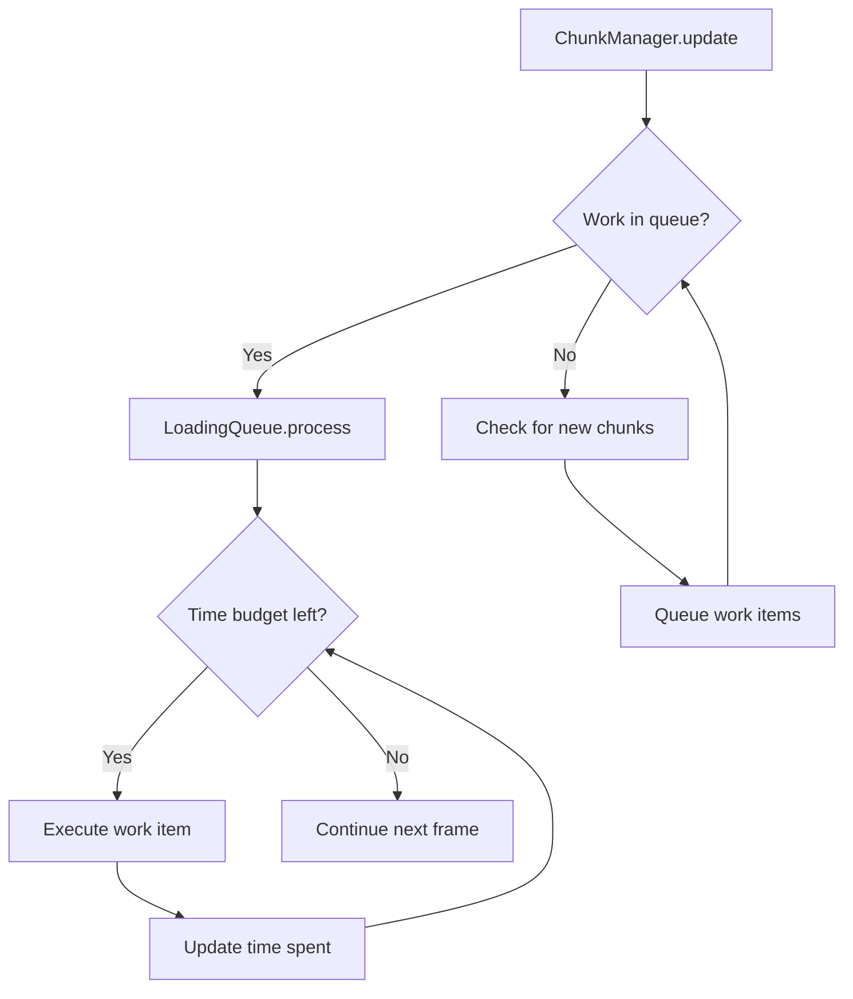

# Phase 1: Performance Fix - Detailed Plan

## 🎯 Objective
Eliminate stuttering during chunk loading by implementing a frame-budget work queue system.

**Target:** Smooth 60fps with no perceptible frame time spikes during camera movement.

---

## 📊 Problem Analysis

### Current Stuttering Source
Located in `chunk_manager.gd`:

**Line 98-104:** `update()` called every frame
```gdscript
func update(delta: float, camera_pos: Vector3):
    update_timer += delta
    if update_timer >= chunk_update_interval:  # Every 1 second
        var camera_pos_2d = Vector2(camera_pos.x, -camera_pos.z)
        _update_streaming(camera_pos_2d)
        _load_distant_water(camera_pos_2d, chunk_load_radius * 2.0)  # ← UNBOUNDED!
        update_timer = 0.0
```

**Line 219-262:** `_update_streaming()` synchronous loading
```gdscript
func _update_streaming(camera_pos_2d: Vector2):
    # Load up to 2 chunks immediately
    for chunk_key in new_chunks:
        if chunks_loaded >= max_chunks_per_frame:
            break
        load_chunk(chunk_key)  # ← Synchronous mesh generation
        chunks_loaded += 1
```

**Line 369-396:** `_load_distant_water()` unbounded work
```gdscript
func _load_distant_water(camera_pos: Vector2, extended_radius: float):
    # No frame budget limit!
    # Can generate multiple large water meshes in one frame
    var water_node = WaterGenerator.create_water(footprint, water_data, scene_root)
```

### Mesh Generation Cost
Each `load_chunk()` call triggers:
- `BuildingGeneratorMesh.generate_building()` - walls + windows + roof
- `RoadGenerator.create_road()` - road ribbon mesh
- `ParkGenerator.create_park()` - park mesh
- `WaterGenerator.create_water()` - water mesh

**Estimated costs:**
- Simple building: ~5-10ms
- Complex building: ~20-50ms
- Road: ~2-5ms
- Park: ~3-10ms
- Lake Union: ~100-200ms (thousands of vertices)

**Result:** Frame time spikes of 50-300ms every second.

---

## 💡 Solution: Frame-Budget Queue System

### Architecture



### Components

**1. LoadingQueue Class** (new file: `scripts/city/loading_queue.gd`)
- Manages queue of work items
- Tracks frame time budget (5ms default)
- Processes work gradually
- Emits progress signals

**2. Work Item Structure**
```gdscript
{
    "type": "building|road|park|water",
    "data": {building_data or road_data or ...},
    "chunk_key": Vector2i,
    "chunk_node": Node3D,
    "priority": float  # distance from camera
}
```

**3. Modified ChunkManager**
- Queue work items instead of immediate execution
- Call `loading_queue.process()` each frame
- Track chunk loading states (unloaded, loading, loaded)

---

## 📝 Implementation Tasks

### Task 1.1: Add Profiling Instrumentation
**File:** `scripts/city/chunk_manager.gd`
**Estimate:** 30 minutes

Add timing measurements:
```gdscript
var start_time = Time.get_ticks_usec()
# ... do work ...
var elapsed = (Time.get_ticks_usec() - start_time) / 1000.0  # ms
print("Chunk load took: ", elapsed, "ms")
```

**Measure:**
- `load_chunk()` total time
- Individual generator times
- `_load_distant_water()` time
- Frame time distribution

**Document results in:** `performance/profiling/baseline-measurements.md`

---

### Task 1.2: Design LoadingQueue Architecture
**Files:** New design document
**Estimate:** 1 hour

Create `performance/frame-budget-design.md` with:
- LoadingQueue class interface
- Work item structure
- Processing algorithm
- State machine for chunks
- Integration points

**Key decisions:**
- Frame budget: 5ms (configurable)
- Priority system: Distance from camera
- Work item granularity: Per building/road/park/water
- Error handling: Failed work items

---

### Task 1.3: Implement LoadingQueue Class
**File:** `scripts/city/loading_queue.gd` (new)
**Estimate:** 2 hours

**Class structure:**
```gdscript
extends RefCounted
class_name LoadingQueue

signal work_completed(type: String, chunk_key: Vector2i)
signal queue_empty()

var work_queue: Array = []
var frame_budget_ms: float = 5.0
var is_processing: bool = false

func queue_work(work_item: Dictionary) -> void
func process(delta: float) -> void
func clear_queue() -> void
func get_stats() -> Dictionary
```

**Features:**
- Priority queue (sort by distance)
- Frame time tracking
- Work item execution
- Progress reporting

---

### Task 1.4: Refactor FeatureFactory
**File:** `scripts/generators/feature_factory.gd`
**Estimate:** 1 hour

Change methods to return work items:
```gdscript
# Before:
func create_buildings_for_chunk(buildings_data, chunk_node, buildings_array):
    for building_data in buildings_data:
        # Create immediately

# After:
func create_building_work_items(buildings_data, chunk_key, chunk_node, camera_pos):
    var items = []
    for building_data in buildings_data:
        items.append({
            "type": "building",
            "data": building_data,
            "chunk_key": chunk_key,
            "chunk_node": chunk_node,
            "priority": calculate_priority(building_data, camera_pos)
        })
    return items
```

---

### Task 1.5: Refactor ChunkManager to Use Queue
**File:** `scripts/city/chunk_manager.gd`
**Estimate:** 2-3 hours

**Changes needed:**

1. **Add loading queue:**
```gdscript
var loading_queue: LoadingQueue
var chunk_states: Dictionary = {}  # Vector2i → "unloaded|loading|loaded"

func _init(p_feature_factory, p_scene_root: Node3D):
    # ... existing ...
    loading_queue = LoadingQueue.new()
    loading_queue.work_completed.connect(_on_work_completed)
```

2. **Modify load_chunk():**
```gdscript
func load_chunk(chunk_key: Vector2i):
    if chunk_states.get(chunk_key) != null:
        return  # Already queued or loaded

    # Create chunk container
    var chunk_node = Node3D.new()
    # ... setup ...

    # Mark as loading
    chunk_states[chunk_key] = "loading"

    # Queue work items instead of creating immediately
    var work_items = feature_factory.create_work_items_for_chunk(...)
    for item in work_items:
        loading_queue.queue_work(item)
```

3. **Modify update():**
```gdscript
func update(delta: float, camera_pos: Vector3):
    # Process loading queue every frame
    loading_queue.process(delta)

    # Check for chunk streaming less frequently
    update_timer += delta
    if update_timer >= chunk_update_interval:
        _update_streaming(camera_pos_2d)
        _queue_distant_water(camera_pos_2d)  # Changed!
        update_timer = 0.0
```

4. **Add work completion handler:**
```gdscript
func _on_work_completed(type: String, chunk_key: Vector2i):
    # Check if chunk fully loaded
    if all_work_done_for_chunk(chunk_key):
        chunk_states[chunk_key] = "loaded"
        chunk_loaded.emit(chunk_key, get_feature_counts(chunk_key))
```

---

### Task 1.6: Fix Distant Water Loading
**File:** `scripts/city/chunk_manager.gd`
**Estimate:** 30 minutes

Change `_load_distant_water()` to queue work:
```gdscript
func _queue_distant_water(camera_pos: Vector2):
    # Changed from _load_distant_water
    var distant_chunks = get_chunks_in_radius(camera_pos, chunk_load_radius * 2.0)

    for chunk_key in distant_chunks:
        if active_chunks.has(chunk_key):
            continue

        var water_in_chunk = water_data_by_chunk.get(chunk_key, [])
        for water_data in water_in_chunk:
            if is_large_water_body(water_data):
                # Queue instead of immediate creation
                loading_queue.queue_work({
                    "type": "distant_water",
                    "data": water_data,
                    "chunk_key": chunk_key,
                    "chunk_node": scene_root,
                    "priority": calculate_water_priority(water_data, camera_pos)
                })
```

---

### Task 1.7: Update CityRenderer Integration
**File:** `scripts/city_renderer.gd`
**Estimate:** 30 minutes

**Changes:**
- Remove profiling code (if temporary)
- Ensure loading queue processes in `_process()`
- Update debug UI to show loading stats

```gdscript
func _process(delta: float):
    # ... existing ...

    # Update loading stats
    if chunk_manager:
        var loading_stats = chunk_manager.get_loading_stats()
        debug_ui.update_loading_display(loading_stats)
```

---

### Task 1.8: Update DebugUI
**File:** `scripts/city/debug_ui.gd`
**Estimate:** 30 minutes

Add loading queue visualization:
```
╔════════════════════════════════════╗
║ CHUNK LOADING                      ║
║ Queue: 24 items                    ║
║ Processing: Building (chunk 2,3)   ║
║ Frame budget: 3.2ms / 5.0ms        ║
║ Status: ▓▓▓▓▓▓░░░░ 60%            ║
╚════════════════════════════════════╝
```

---

### Task 1.9: Testing & Validation
**Estimate:** 1-2 hours

**Test scenarios:**
1. **Rapid camera movement**
   - Fly through city at fast speed
   - Monitor frame times
   - Verify no stutters

2. **Chunk boundary crossing**
   - Move between chunks
   - Verify smooth loading

3. **Lake Union approach**
   - Fly toward Lake Union
   - Verify no spike when water loads

4. **Performance comparison**
   - Before: Note average frame time, max spike
   - After: Measure improvement
   - Document in profiling results

**Success criteria:**
- [ ] No frame time spikes >10ms
- [ ] Consistent 60fps during movement
- [ ] Smooth chunk loading
- [ ] Lake Union loads without stutter

---

### Task 1.10: Documentation
**Estimate:** 1 hour

**Update:**
- `PROGRESS.md` - Mark Phase 1 complete
- `performance/profiling/` - Add before/after data
- `code/files-to-modify.md` - Document changes
- `sessions/` - Update session log

**Create:**
- `performance/results.md` - Final performance analysis
- Screenshots/recordings of smooth loading

---

## 📊 Files to Modify

### New Files
- `scripts/city/loading_queue.gd` - LoadingQueue class

### Modified Files
- `scripts/city/chunk_manager.gd` - Use queue, track states
- `scripts/generators/feature_factory.gd` - Return work items
- `scripts/city_renderer.gd` - Integration
- `scripts/city/debug_ui.gd` - Loading stats display

### Unchanged (but important)
- `scripts/generators/building_generator_mesh.gd` - No changes needed
- `scripts/generators/road_generator.gd` - No changes needed
- `scripts/generators/park_generator.gd` - No changes needed
- `scripts/generators/water_generator.gd` - No changes needed

---

## ⏱️ Estimated Timeline

| Task | Estimate | Cumulative |
|------|----------|------------|
| 1.1 Profiling | 0.5h | 0.5h |
| 1.2 Design | 1h | 1.5h |
| 1.3 LoadingQueue | 2h | 3.5h |
| 1.4 FeatureFactory | 1h | 4.5h |
| 1.5 ChunkManager | 2.5h | 7h |
| 1.6 Distant Water | 0.5h | 7.5h |
| 1.7 CityRenderer | 0.5h | 8h |
| 1.8 DebugUI | 0.5h | 8.5h |
| 1.9 Testing | 1.5h | 10h |
| 1.10 Docs | 1h | 11h |

**Total: ~11 hours** (spread across 2-3 sessions)

---

## 🎯 Success Criteria

- [ ] Frame time stays <16.67ms (60fps)
- [ ] No spikes >10ms during chunk loading
- [ ] Lake Union loads smoothly
- [ ] Rapid camera movement smooth
- [ ] Loading queue processes correctly
- [ ] All chunk types load via queue
- [ ] Debug UI shows loading stats
- [ ] Performance improvement documented

---

## 🔮 Future Optimizations

If frame-budget queue is insufficient:
- Add threading (WorkerThreadPool)
- Mesh LOD system
- Simplify geometry for distant objects
- Reduce shadow quality for distant chunks
- Culling improvements

---

Last Updated: 2025-01-23
