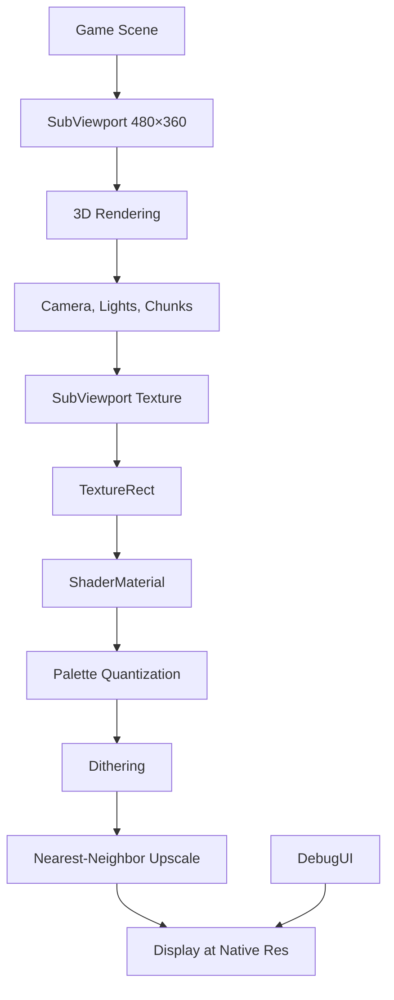

# Native Low-Res Architecture - SubViewport Design

## 🎯 Objective
Design the SubViewport architecture for native low-resolution rendering with proper upscaling and shader integration.

---

## 🏗️ Architecture Overview

### Node Hierarchy

```
CityRenderer (Node3D) [Root scene]
│
├── SubViewport [480×360 rendering]
│   │
│   ├── Camera3D [Player camera]
│   │   └── [Camera controller attached]
│   │
│   ├── DirectionalLight3D [Sun]
│   │   └── [Shadow settings]
│   │
│   ├── WorldEnvironment [Sky, fog, SSAO, etc.]
│   │   └── [Environment resource]
│   │
│   └── [Chunk Containers]
│       ├── Chunk_0_0 (Node3D)
│       │   ├── Building_001 (MeshInstance3D)
│       │   ├── Building_002 (MeshInstance3D)
│       │   ├── Road_001 (MeshInstance3D)
│       │   └── ...
│       ├── Chunk_0_1 (Node3D)
│       └── ...
│
├── CanvasLayer [layer = -1] [Display upscaled result]
│   └── TextureRect [Fullscreen]
│       ├── texture → SubViewport.get_texture()
│       ├── texture_filter = NEAREST
│       └── material → ShaderMaterial
│           └── shader → retro_3d.gdshader
│               ├── Palette quantization
│               ├── Dithering
│               └── Upscaling
│
├── DebugUI (CanvasLayer) [layer = 0] [Native resolution]
│   ├── HUD elements
│   ├── Debug panel
│   └── Retro settings panel
│
├── CameraController [Script component]
│   └── [Controls Camera3D in SubViewport]
│
└── [Other components...]
```

---

## 📊 Rendering Pipeline



**Flow:**
1. 3D scene renders at 480×360 inside SubViewport
2. Result stored in SubViewport's texture
3. TextureRect displays the texture fullscreen
4. Shader processes texture (palette + dither)
5. Nearest-neighbor upscaling (via texture filter)
6. Final output to screen
7. DebugUI overlays at native resolution

---

## 🔧 SubViewport Configuration

### Properties

```gdscript
var sub_viewport = SubViewport.new()

# Size (configurable)
sub_viewport.size = Vector2i(480, 360)

# Update mode
sub_viewport.render_target_update_mode = SubViewport.UPDATE_ALWAYS
# ↑ Render every frame

# Transparency
sub_viewport.transparent_bg = false
# ↑ Opaque background (sky color)

# HDR
sub_viewport.use_hdr_2d = false
# ↑ Not needed for retro look

# MSAA (anti-aliasing)
sub_viewport.msaa_3d = Viewport.MSAA_DISABLED
# ↑ Disabled for pixel-perfect look

# Screen-space AA
sub_viewport.screen_space_aa = Viewport.SCREEN_SPACE_AA_DISABLED
# ↑ Disabled for sharp pixels

# Scaling mode
sub_viewport.scaling_3d_mode = Viewport.SCALING_3D_MODE_BILINEAR
# ↑ Default is fine (internal 3D rendering)

# Snap 2D transforms
sub_viewport.snap_2d_transforms_to_pixel = true
# ↑ Helps with pixel alignment
```

---

## 🖼️ Display Configuration

### TextureRect Setup

```gdscript
var display_rect = TextureRect.new()

# Texture source
display_rect.texture = sub_viewport.get_texture()

# Stretch mode
display_rect.stretch_mode = TextureRect.STRETCH_SCALE
# ↑ Scale to fill window

# Anchors (fullscreen)
display_rect.anchors_preset = Control.PRESET_FULL_RECT
display_rect.set_anchors_and_offsets_preset(Control.PRESET_FULL_RECT)

# Texture filtering
display_rect.texture_filter = CanvasItem.TEXTURE_FILTER_NEAREST
# ↑ CRITICAL: Nearest-neighbor upscaling (crisp pixels)

# Material (shader)
var shader_material = ShaderMaterial.new()
shader_material.shader = load("res://shaders/retro_3d.gdshader")
display_rect.material = shader_material
```

---

## 🎨 Shader Integration

### Shader Pipeline

**Input:** SubViewport texture (480×360)
**Processing:**
1. Sample texture at screen UV
2. Apply dithering (Bayer matrix)
3. Quantize to color palette
4. Output final color

**Output:** Upscaled to window size (automatic via NEAREST filter)

### Shader Material Setup

```gdscript
func _setup_retro_shader():
    var shader = load("res://shaders/retro_3d.gdshader")
    var material = ShaderMaterial.new()
    material.shader = shader

    # Load palette
    var palette_data = load("res://visuals/palettes/psx_64.gd")

    # Set uniforms
    material.set_shader_parameter("palette_size", 64)

    # Set palette colors (array)
    for i in range(palette_data.PALETTE.size()):
        # Note: Godot shader arrays need to be set as full array or individually
        # Setting individually for each color:
        material.set_shader_parameter("palette", palette_data.PALETTE)

    material.set_shader_parameter("dither_strength", 1.0)
    material.set_shader_parameter("enable_dithering", true)

    # Apply to display rect
    display_rect.material = material
```

---

## 📐 Resolution Presets

### Supported Resolutions

| Name | Resolution | Aspect | Upscale Factor (1080p) |
|------|------------|--------|------------------------|
| 240p | 320×240 | 4:3 | 4.5x / 8x |
| 360p | 480×360 | 4:3 | 3x / 6x |
| 480p | 640×480 | 4:3 | 2.25x / 4x |
| 540p | 960×540 | 16:9 | 2x |

**Note:** 4:3 resolutions will have letterboxing on 16:9 displays or need aspect adjustment.

### Resolution Switching

```gdscript
func set_viewport_resolution(width: int, height: int):
    sub_viewport.size = Vector2i(width, height)
    print("Resolution changed to: ", width, "x", height)

    # Texture automatically updates
    # No need to recreate display_rect
```

**Real-time switching:** Works instantly, no restart needed.

---

## 🔗 Component Integration

### Camera Controller

**Before:**
```gdscript
func setup_camera(parent: Node, start_pos: Vector3):
    camera = Camera3D.new()
    parent.add_child(camera)  # parent = CityRenderer
```

**After:**
```gdscript
func setup_camera(parent: Node, start_pos: Vector3):
    camera = Camera3D.new()
    parent.add_child(camera)  # parent = SubViewport
    # Everything else unchanged
```

**Key point:** Camera lives inside SubViewport now.

---

### Chunk Manager

**Before:**
```gdscript
func _init(p_feature_factory, p_scene_root: Node3D):
    scene_root = p_scene_root  # CityRenderer
```

**After:**
```gdscript
func _init(p_feature_factory, p_scene_root: Node3D):
    scene_root = p_scene_root  # SubViewport
    # Chunks created as children of SubViewport
```

**Key point:** All chunks created inside SubViewport now.

---

### Debug UI

**No changes needed:**
```gdscript
# DebugUI added to CityRenderer (not SubViewport)
# Renders at native resolution automatically
debug_ui = DebugUI.new()
add_child(debug_ui)  # self = CityRenderer
```

**Key point:** DebugUI stays outside SubViewport for native res rendering.

---

## ⚡ Performance Characteristics

### Rendering Cost Reduction

**1080p (1920×1080):**
- Pixels: 2,073,600
- Shading cost: 100%

**480p (480×360):**
- Pixels: 172,800
- Shading cost: ~8% (12x fewer pixels)
- **Savings: 92% GPU cost for shading, lighting, post-processing**

**Trade-offs:**
- ✅ Huge performance gain
- ✅ Authentic retro look
- ⚠️ Lower visual fidelity (by design)
- ⚠️ Shader cost on TextureRect (minimal)

### Shader Cost

**Retro shader cost:**
- Runs once per screen pixel (1920×1080)
- Simple operations (palette lookup, dithering)
- Estimated: <1ms per frame

**Net result:** Still massive performance gain.

---

## 🎯 Coordinate Systems

### World Space (3D)
- Unchanged
- 1 unit = 1 meter
- Buildings, roads, chunks all same

### Screen Space (2D)
- SubViewport: 480×360 pixels
- Display: Full window (e.g., 1920×1080)
- Mouse coordinates need conversion

### Mouse Input Handling

**Mouse coordinates are in native resolution:**
```gdscript
# For 3D raycasting from mouse:
# Convert screen coords to SubViewport coords
func get_viewport_mouse_position() -> Vector2:
    var mouse_pos = get_viewport().get_mouse_position()
    var window_size = get_viewport().get_visible_rect().size
    var viewport_size = Vector2(sub_viewport.size)

    # Scale from window to SubViewport
    var scaled_pos = mouse_pos * (viewport_size / window_size)
    return scaled_pos
```

**For camera controller:** Mouse movement unchanged (uses relative motion).

---

## 🔄 Scene Tree Changes

### Before Architecture
```
CityRenderer (Node3D)
├── Camera3D
├── DirectionalLight3D
├── WorldEnvironment
├── Chunk_0_0
├── Chunk_0_1
└── ...
```

### After Architecture
```
CityRenderer (Node3D)
├── SubViewport
│   ├── Camera3D
│   ├── DirectionalLight3D
│   ├── WorldEnvironment
│   ├── Chunk_0_0
│   └── ...
├── CanvasLayer
│   └── TextureRect
└── DebugUI (CanvasLayer)
```

**Migration:** Move nodes from CityRenderer to SubViewport.

---

## 🧪 Testing Considerations

### Test Cases

1. **Basic rendering**
   - SubViewport renders scene correctly
   - Upscaling works
   - No visual artifacts

2. **Camera movement**
   - Mouse look works
   - WASD movement works
   - Speed controls work

3. **Chunk loading**
   - Chunks appear correctly
   - Unloading works
   - No reference errors

4. **Resolution switching**
   - All presets work
   - No crashes
   - Performance scales appropriately

5. **Debug UI**
   - UI visible at native res
   - Text readable
   - Controls functional

6. **Shader effects**
   - Palette quantization working
   - Dithering visible
   - Configurable parameters work

---

## 🚧 Migration Risks

### Potential Issues

1. **Reference errors**
   - Components expecting CityRenderer as parent
   - Need to update to SubViewport

2. **Coordinate conversion**
   - Mouse picking may need adjustment
   - UI positioning relative to 3D objects

3. **Performance regression**
   - Shader cost may be higher than expected
   - Need profiling to verify gains

4. **Visual artifacts**
   - Texture filtering issues
   - Aspect ratio problems
   - Alignment glitches

### Mitigation Strategies

- Thorough testing of all references
- Add coordinate conversion helpers
- Profile before/after
- Test on multiple window sizes
- Validate on different GPUs

---

## 🔮 Future Enhancements

### Dynamic Resolution Scaling
```gdscript
func adjust_resolution_for_performance():
    var fps = Engine.get_frames_per_second()

    if fps < 55:
        # Drop resolution
        if current_res == "480p":
            set_viewport_resolution(480, 360)  # 360p
    elif fps > 65:
        # Increase resolution
        if current_res == "360p":
            set_viewport_resolution(640, 480)  # 480p
```

### Aspect Ratio Handling
```gdscript
func adjust_for_window_aspect():
    var window_aspect = get_window_aspect_ratio()

    if abs(window_aspect - (16.0/9.0)) < 0.01:
        # 16:9 display, use 16:9 resolutions
        set_viewport_resolution(960, 540)
    else:
        # 4:3 or other, use 4:3 with letterboxing
        set_viewport_resolution(480, 360)
```

---

Last Updated: 2025-01-23
Status: Design complete, ready for implementation
