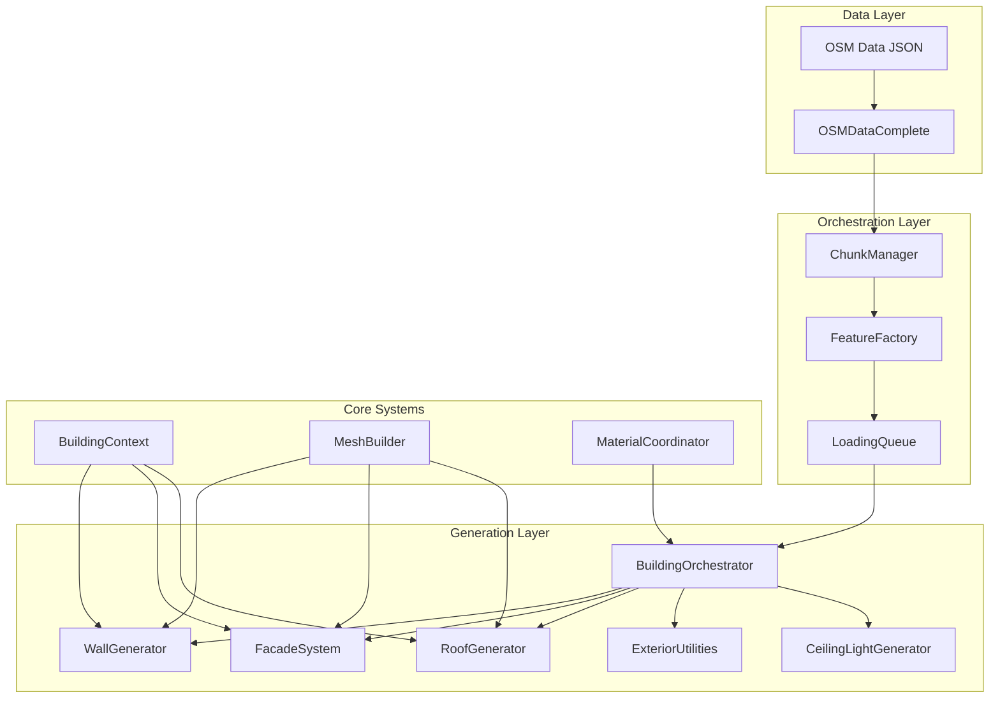
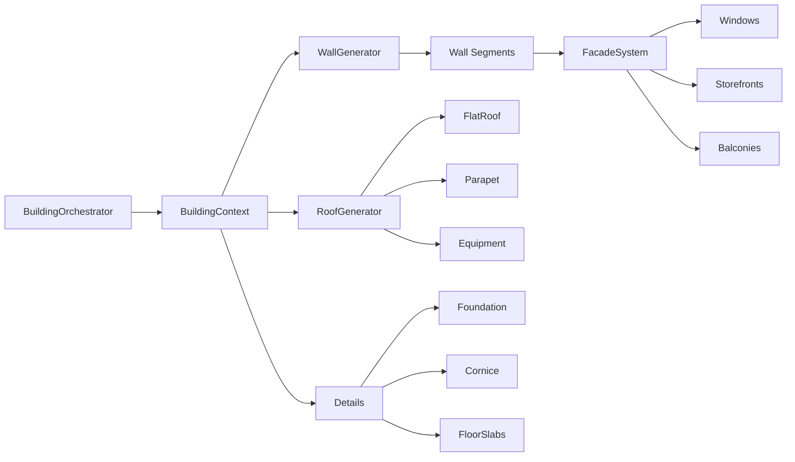

# Building Generation Pipeline

This document describes the complete building generation pipeline from OSM data to rendered 3D geometry.

## Architecture Overview



## Pipeline Stages

### Stage 1: Data Loading

**Entry Point**: `scripts/data/osm_data_complete.gd`

1. OSM JSON is loaded from `res://data/osm_complete.json`
2. Buildings extracted with properties: footprint, height, levels, building type, color
3. Data organized into chunks by `ChunkManager.organize_data()`

```gdscript
# Key data structure per building
{
    "id": 12345,
    "footprint": [Vector2, Vector2, ...],  # Polygon vertices
    "center": Vector2,
    "height": 15.0,
    "levels": 5,
    "building": "commercial",  # OSM building type
    "colour": "#ff0000",       # Optional facade color
    "name": "Space Needle"     # Optional
}
```

### Stage 2: Chunk-Based Streaming

**Entry Point**: `scripts/city/chunk_manager.gd`

1. World divided into 500m x 500m chunks (configurable via `GameConfig.CHUNK_SIZE`)
2. Chunks loaded/unloaded based on camera distance
3. Each building assigned to chunk by center point

```
Chunk Lifecycle:
  unloaded → loading → loaded → unloaded (when camera leaves)
```

### Stage 3: Work Queue Processing

**Entry Point**: `scripts/city/loading_queue.gd`

1. Buildings queued as work items with priority (distance to camera)
2. Frame budget limits processing time (~5ms default)
3. Closest buildings processed first

```gdscript
# Work item structure
{
    "type": "building",
    "chunk_key": Vector2i(-1, -4),
    "data": building_osm_data,
    "chunk_node": Node3D,        # Parent for generated mesh
    "tracking_array": Array,     # For cleanup
    "priority": 150.0,           # Distance to camera
    "estimated_cost_ms": 8.0     # Profiled generation time
}
```

### Stage 4: Building Orchestration

**Entry Point**: `scripts/generators/building/building_orchestrator.gd`

The orchestrator coordinates all subsystems:



### Stage 5: Component Generators

#### WallGenerator
`scripts/generators/building/walls/wall_generator.gd`

- Generates main wall geometry from footprint
- Creates wall segments for facade attachment
- Tracks floor elevations for window placement

#### FacadeSystem
`scripts/generators/building/facades/facade_system.gd`

- Analyzes wall segments for facade potential
- Creates windows with frames
- Generates storefronts for ground floor commercial
- Adds balconies, entrances, awnings

#### RoofGenerator
`scripts/generators/building/roofs/roof_generator.gd`

- Determines roof type (flat, gabled, hipped)
- Generates appropriate roof mesh
- Adds details: parapets, HVAC equipment, antennas

#### MaterialCoordinator
`scripts/generators/building/materials/material_coordinator.gd`

- Resolves colors from OSM data
- Creates consistent material sets
- Handles glass, frame, wall, roof materials

## Mesh Surface Structure

Buildings use multi-surface meshes for material assignment:

| Surface Index | Name    | Purpose                    |
|--------------|---------|----------------------------|
| 0            | wall    | Main building walls        |
| 1            | glass   | Windows and glass facades  |
| 2            | frame   | Window/door frames         |
| 3            | roof    | Roof surface               |
| 4            | floor   | Exposed floor slabs        |

## Performance Characteristics

| Operation              | Typical Time | Notes                    |
|-----------------------|--------------|--------------------------|
| Simple building       | 2-4ms        | <5 floors, basic facade  |
| Complex commercial    | 6-10ms       | Storefronts, details     |
| Large landmark        | 10-15ms      | Many floors, full detail |
| Frame budget          | 5ms          | Configurable             |

## Configuration

All constants centralized in `scripts/config/game_config.gd`:

```gdscript
# Chunk streaming
const CHUNK_SIZE: float = 500.0
const CHUNK_LOAD_RADIUS: float = 750.0
const CHUNK_UNLOAD_RADIUS: float = 1500.0

# Loading queue
const LOADING_FRAME_BUDGET_MS: float = 5.0
const LOADING_MAX_QUEUE_SIZE: int = 2000
```

## Key Files Reference

| File | Purpose |
|------|---------|
| `scripts/city/chunk_manager.gd` | Chunk streaming coordinator |
| `scripts/city/loading_queue.gd` | Frame-budgeted work queue |
| `scripts/generators/feature_factory.gd` | Work item creation |
| `scripts/generators/building/building_orchestrator.gd` | Main building generator |
| `scripts/generators/building/core/building_context.gd` | Per-building state |
| `scripts/generators/building/core/mesh_builder.gd` | Geometry utilities |
| `scripts/generators/building/walls/wall_generator.gd` | Wall geometry |
| `scripts/generators/building/facades/facade_system.gd` | Windows & facades |
| `scripts/generators/building/roofs/roof_generator.gd` | Roof generation |
| `scripts/generators/building/materials/material_coordinator.gd` | Material management |

## Adding New Building Features

1. Create generator in appropriate subfolder (`facades/`, `roofs/`, `exterior/`)
2. Add preload to `BuildingOrchestrator`
3. Call from `_create_building_mesh()` with appropriate context
4. Add surfaces to mesh if new material type needed
5. Update `MaterialCoordinator` for new materials
