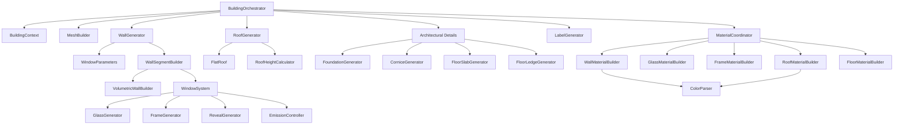

# Building Generator Architecture

## Overview

The Building Generator creates procedural 3D buildings from OpenStreetMap (OSM) data using a modular, fine-grained architecture. This refactored system replaces a monolithic 1865-line file with 29 specialized modules organized in a deep directory structure for maximum extensibility.

## Architecture Diagram



## Directory Structure

```
scripts/generators/building/
├── building_orchestrator.gd          # Main coordinator
├── core/                              # Core infrastructure
│   ├── building_context.gd           # Shared state object
│   ├── mesh_builder.gd                # ArrayMesh construction
│   ├── geometry_utils.gd              # Math helpers
│   └── osm_parser.gd                  # OSM data normalization
├── walls/                             # Wall generation
│   ├── wall_generator.gd              # Wall coordinator
│   ├── segments/
│   │   ├── wall_segment_builder.gd    # Wall segments with windows
│   │   └── volumetric_wall_builder.gd # 6-face volumetric walls
│   └── details/
│       ├── foundation_generator.gd    # Building foundation
│       ├── cornice_generator.gd       # Top decorative band
│       ├── floor_slab_generator.gd    # Horizontal concrete floors
│       └── floor_ledge_generator.gd   # Floor divider bands
├── windows/                           # Window generation
│   ├── window_system.gd               # Window coordinator
│   ├── types/                         # Future: window type variations
│   ├── components/
│   │   ├── glass_generator.gd         # Window glass panes
│   │   ├── frame_generator.gd         # Window frames
│   │   └── reveal_generator.gd        # Window reveals (wall depth)
│   └── features/
│       └── emission_controller.gd     # Nighttime window lighting
├── roofs/                             # Roof generation
│   ├── roof_generator.gd              # Roof coordinator
│   ├── shapes/
│   │   └── flat_roof.gd               # Flat roof (active)
│   │   # gabled_roof.gd (disabled)
│   │   # hipped_roof.gd (disabled)
│   │   # pyramidal_roof.gd (disabled)
│   └── details/
│       └── roof_height_calculator.gd  # Roof height from OSM
├── facades/                           # Future: storefront variations
│   ├── storefronts/                   # Future: commercial facades
│   ├── balconies/                     # Future: residential balconies
│   └── access/                        # Future: doors, stairs, ramps
├── interior/                          # Future: interior features
│   ├── ceiling_lights/                # Future: interior ceiling lights
│   ├── wall_fixtures/                 # Future: interior wall lights
│   └── furniture/                     # Future: interior furniture
├── materials/                         # Material generation
│   ├── material_coordinator.gd        # Material coordinator
│   ├── builders/
│   │   ├── wall_material_builder.gd   # Wall materials
│   │   ├── glass_material_builder.gd  # Glass materials
│   │   ├── frame_material_builder.gd  # Frame materials
│   │   ├── roof_material_builder.gd   # Roof materials
│   │   └── floor_material_builder.gd  # Floor materials
│   └── parsers/
│       └── color_parser.gd            # OSM color parsing
└── utilities/                         # Utilities
    ├── window_parameters.gd           # Window size/spacing calculator
    └── label_generator.gd             # 3D text labels
```

## Core Concepts

### Multi-Surface ArrayMesh

All building geometry is generated into a single `ArrayMesh` with 5 surfaces:

1. **Wall Surface** - Opaque walls, foundations, cornices, floor slabs/ledges
2. **Glass Surface** - Transparent window glass with per-vertex emission colors
3. **Frame Surface** - Window frames (dark gray)
4. **Roof Surface** - Roof geometry (separate for OSM colors/materials)
5. **Floor Surface** - Floor slabs (concrete)

### Building Context

`BuildingContext` is a shared state object passed to all subsystems:

```gdscript
var context = BuildingContext.new()
context.osm_data = {...}
context.footprint = [...]
context.center = Vector2(...)
context.height = 12.0
context.levels = 4
context.detailed = true
context.material_lib = material_library
```

### Dependency Injection

All generators use **static functions** with **dependency injection**:

```gdscript
WallGenerator.generate_walls(context, surfaces)
RoofGenerator.generate_roof(context, surfaces)
MaterialCoordinator.apply_materials(mesh_instance, surface_indices, osm_data, material_lib)
```

No global state, no singleton patterns. All dependencies are explicit.

### Coordinator Pattern

Each subsystem has a coordinator that delegates to specialized modules:

- **WallGenerator** → WindowParameters + WallSegmentBuilder → VolumetricWallBuilder + WindowSystem
- **WindowSystem** → GlassGenerator + FrameGenerator + RevealGenerator + EmissionController
- **RoofGenerator** → FlatRoof (+ future: GabledRoof, HippedRoof, PyramidalRoof)
- **MaterialCoordinator** → 5 MaterialBuilders + ColorParser

## Building Generation Flow

```
BuildingOrchestrator.create_building()
    │
    ├─> Parse OSM data → BuildingContext
    ├─> Create 5 MeshSurfaceData objects
    │
    ├─> WallGenerator.generate_walls()
    │   ├─> For each wall segment:
    │   │   ├─> Calculate window placement
    │   │   ├─> VolumetricWallBuilder (6-face wall geometry)
    │   │   └─> WindowSystem.add_window()
    │   │       ├─> RevealGenerator (wall depth)
    │   │       ├─> GlassGenerator (glass pane)
    │   │       ├─> FrameGenerator (window frame)
    │   │       └─> EmissionController (window lighting)
    │
    ├─> FoundationGenerator.generate() [if detailed]
    ├─> CorniceGenerator.generate() [if detailed, multi-story]
    ├─> FloorLedgeGenerator.generate() [if detailed, multi-story]
    ├─> FloorSlabGenerator.generate() [if detailed, multi-story]
    │
    ├─> RoofGenerator.generate_roof()
    │   └─> FlatRoof.generate() [currently only flat roofs]
    │
    ├─> MeshBuilder builds ArrayMesh from 5 surfaces
    │
    ├─> MaterialCoordinator.apply_materials()
    │   ├─> WallMaterialBuilder.create()
    │   ├─> GlassMaterialBuilder.create()
    │   ├─> FrameMaterialBuilder.create()
    │   ├─> RoofMaterialBuilder.create()
    │   └─> FloorMaterialBuilder.create()
    │
    └─> LabelGenerator.add_label() → 3D text label
```

## Module Details

### Core Systems

#### BuildingOrchestrator
- **Purpose**: Main entry point, coordinates all subsystems
- **API**: `create_building(osm_data, parent, detailed, material_lib) -> Node3D`
- **Lines**: 137

#### BuildingContext
- **Purpose**: Shared state object for all subsystems
- **Properties**: `osm_data`, `footprint`, `center`, `height`, `levels`, `detailed`, `material_lib`
- **Lines**: 34

#### MeshBuilder
- **Purpose**: ArrayMesh construction and surface management
- **Classes**: `MeshSurfaceData` (vertices, normals, UVs, colors, indices)
- **Lines**: 22

#### GeometryUtils
- **Purpose**: Math helpers for wall normals, tangents, bounding boxes
- **Functions**: `calculate_wall_normal()`, `calculate_bounding_box()`, etc.
- **Lines**: 36

#### OSMParser
- **Purpose**: OSM data normalization and parsing
- **Functions**: `get_building_label()`, `normalize_building_type()`, etc.
- **Lines**: 34

### Wall Systems

#### WallGenerator
- **Purpose**: Wall generation coordinator
- **Function**: `generate_walls(context, surfaces)`
- **Lines**: 35

#### WallSegmentBuilder
- **Purpose**: Builds individual wall segments with window cutouts
- **Function**: `create_wall_segment(p1, p2, height, floor_height, ...)`
- **Lines**: 154

#### VolumetricWallBuilder
- **Purpose**: Creates 6-faced volumetric wall geometry (25cm thickness)
- **Function**: `add_volumetric_wall_quad(p1, p2, y_bottom, y_top, normal, ...)`
- **Details**: Each wall has outer face, inner face, top edge, bottom edge, left edge, right edge
- **Lines**: 190

### Window Systems

#### WindowSystem
- **Purpose**: Window generation coordinator
- **Function**: `add_window(p1, p2, left_t, right_t, bottom, top, normal, ...)`
- **Lines**: 38

#### GlassGenerator
- **Purpose**: Generates window glass panes (15cm recess)
- **Function**: `generate(p1, p2, left_t, right_t, bottom, top, normal, emission, ...)`
- **Lines**: 56

#### FrameGenerator
- **Purpose**: Generates window frames (8cm thickness, 4 pieces)
- **Function**: `generate(p1, p2, left_t, right_t, bottom, top, normal, ...)`
- **Lines**: 95

#### RevealGenerator
- **Purpose**: Generates window reveals (wall thickness around window)
- **Function**: `generate(p1, p2, left_t, right_t, bottom, top, normal, ...)`
- **Lines**: 145

#### EmissionController
- **Purpose**: Controls window emission for nighttime lighting
- **Function**: `generate_window_emission() -> Color`
- **Details**: 40% lit, 4 color types (warm yellow 60%, neutral white 25%, dim warm 10%, blue TV 5%)
- **Lines**: 38

### Roof Systems

#### RoofGenerator
- **Purpose**: Roof generation coordinator
- **Function**: `generate_roof(context, surfaces)`
- **Status**: Only flat roofs enabled (sloped roofs disabled due to geometry issues)
- **Lines**: 32

#### FlatRoof
- **Purpose**: Flat roof algorithm using polygon triangulation
- **Function**: `generate(footprint, center, building_height, roof_surface)`
- **Lines**: 44

#### RoofHeightCalculator
- **Purpose**: Calculates roof height from OSM data
- **Priority**: explicit height > angle calculation > roof levels > 15% fallback
- **Lines**: 47

### Architectural Details

#### FoundationGenerator
- **Purpose**: Building foundation (1m tall, 5cm protrusion)
- **Faces**: Outer face, top face
- **Lines**: 87

#### CorniceGenerator
- **Purpose**: Decorative protruding band at building top (50cm tall, 35cm protrusion)
- **Faces**: Outer face, bottom face, top face
- **Lines**: 113

#### FloorSlabGenerator
- **Purpose**: Horizontal concrete floors at each level (25cm thick)
- **Faces**: Top face, bottom face, edge faces
- **Lines**: 95

#### FloorLedgeGenerator
- **Purpose**: Horizontal decorative bands between floors (25cm tall, 20cm protrusion)
- **Faces**: Outer face, bottom face, top face
- **Lines**: 113

### Material Systems

#### MaterialCoordinator
- **Purpose**: Coordinates material creation and application
- **Function**: `apply_materials(mesh_instance, surface_indices, osm_data, material_lib)`
- **Lines**: 46

#### WallMaterialBuilder
- **Purpose**: Creates wall materials with PBR properties
- **Priority**: OSM color > material type > building type variety
- **Types**: Residential (warm), Commercial (gray), Industrial (utilitarian)
- **Lines**: 106

#### GlassMaterialBuilder
- **Purpose**: Creates window glass shader material
- **Properties**: Transparent, reflective, per-vertex emission control
- **Lines**: 42

#### FrameMaterialBuilder
- **Purpose**: Creates window frame material (dark gray, slight metallic)
- **Lines**: 24

#### RoofMaterialBuilder
- **Purpose**: Creates roof material based on OSM data
- **Priority**: OSM color > material type > realistic variety
- **Lines**: 79

#### FloorMaterialBuilder
- **Purpose**: Creates concrete floor material (gray)
- **Lines**: 23

#### ColorParser
- **Purpose**: Parses OSM color strings (hex, CSS, named colors)
- **Lines**: 32

### Utilities

#### WindowParameters
- **Purpose**: Calculates window spacing/size based on building type
- **Types**: Commercial (2.5m spacing), Residential (3.5m), Industrial (5m)
- **Lines**: 33

#### LabelGenerator
- **Purpose**: Creates 3D text labels for buildings
- **Function**: `add_label(building, name, height, base_elevation)`
- **Lines**: 36

## Performance Characteristics

- **Static Functions**: No instance overhead, pure functions
- **Single ArrayMesh**: All geometry in one mesh for efficient rendering
- **Multi-Surface**: Separate materials without mesh duplication
- **Dependency Injection**: No global state, thread-safe
- **Fine-Grained Modules**: Small files (20-200 lines), fast loading
- **Window Emission**: Per-vertex colors, no additional draw calls

## Future Extensions

The directory structure includes placeholders for future features:

### Facades
- **storefronts/** - Commercial ground-floor facades with large windows
- **balconies/** - Residential balconies with railings
- **access/** - Doors, stairs, ramps, building entrances

### Interior
- **ceiling_lights/** - Interior ceiling lights (currently planned)
- **wall_fixtures/** - Wall-mounted lights, switches
- **furniture/** - Basic interior furniture

### Windows
- **types/** - Different window types (bay windows, dormers, skylights)

### Roofs
- **shapes/** - Currently has flat_roof.gd (active) and 3 disabled shapes (gabled, hipped, pyramidal)
  - Sloped roofs need geometry fixes for irregular footprints

## Testing

The refactored system maintains the exact same API as the original:

```gdscript
BuildingOrchestrator.create_building(osm_data, parent, detailed, material_lib)
```

This allows drop-in replacement in `FeatureFactory`:

```gdscript
const BuildingOrchestrator = preload("res://scripts/generators/building/building_orchestrator.gd")

BuildingOrchestrator.create_building(feature_data, parent, is_detailed(), material_library)
```

## Debugging

Each module is small and focused:
- **Smallest**: FrameMaterialBuilder, FloorMaterialBuilder (22 lines)
- **Largest**: VolumetricWallBuilder (183 lines), WallSegmentBuilder (153 lines)
- **Average**: ~65 lines per module

Small modules mean:
- Easy to understand
- Fast to debug
- Simple to test
- Clear responsibility

## Migration Notes

### From Backup to New Architecture

The original `building_generator_mesh.gd` (1865 lines) has been refactored into 29 modules:

- **4 core modules** (BuildingContext, MeshBuilder, GeometryUtils, OSMParser)
- **7 wall modules** (WallGenerator, WallSegmentBuilder, VolumetricWallBuilder, Foundation, Cornice, FloorSlab, FloorLedge)
- **5 window modules** (WindowSystem, GlassGenerator, FrameGenerator, RevealGenerator, EmissionController)
- **3 roof modules** (RoofGenerator, FlatRoof, RoofHeightCalculator)
- **7 material modules** (MaterialCoordinator, 5 builders, ColorParser)
- **2 utility modules** (WindowParameters, LabelGenerator)
- **1 orchestrator** (BuildingOrchestrator)

## Version History

- **v1.0** (Original): Monolithic 1865-line file
- **v2.0** (Current): Modular architecture with 29 specialized modules
